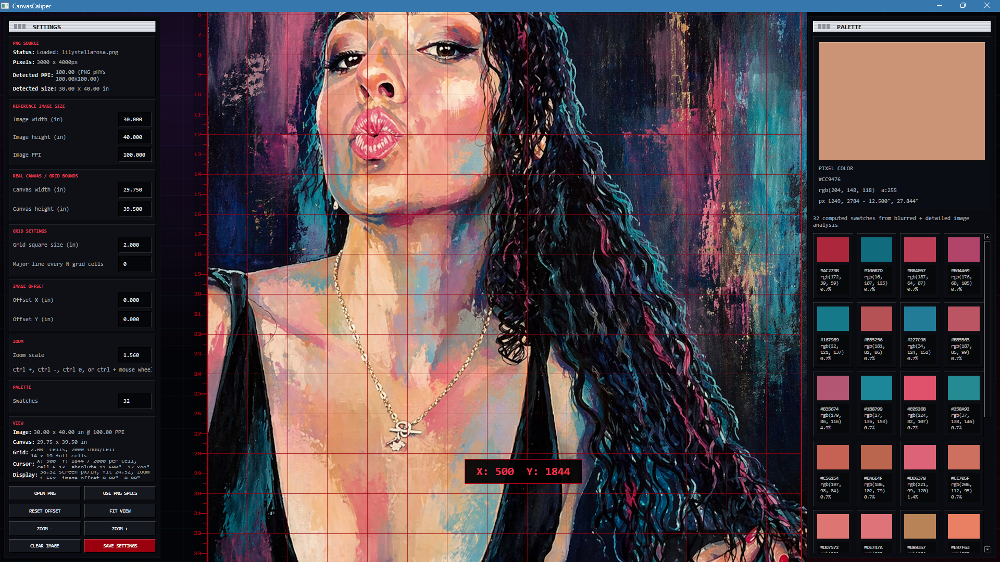

# CanvasCaliper

CanvasCaliper is a precision image measurement tool for loading a PNG, mapping it to real-world
inch dimensions, overlaying a calibrated grid, sampling pixel colors, and inspecting
selected grid regions at higher detail.



## Quick Start

`CanvasCaliper.py` uses the Python interpreter you launch it with. If PySide6 is not
installed for that interpreter, the launcher installs `PySide6==6.11.1` into the current
user site-packages and then starts the app.

Manual install is also supported:

```shell
python -m pip install --user -r requirements.txt
python -m canvascaliper
```

## Main Canvas Controls

- Left-click a grid cell to open the zoomed Grid Region inspector.
- Left-click drag across cells to select a square grid region.
- Right-click drag to pan the zoomed work view.
- Use `Ctrl +` or `Ctrl -` to zoom in and out.
- Use `Ctrl 0` or `Fit View` to return to the fitted view.
- Use `Ctrl + mouse wheel` to zoom from anywhere in the main app window.
- Use `Zoom +` and `Zoom -` in the Settings panel for button-driven zoom.
- Use `Reset Offset` to return the image offset to zero.
- Use `Clear Image` to unload the current PNG.

The red cursor tag reports local X/Y thousandths within the current grid cell. For a
2-inch grid cell, for example, the tag reports values from `0` to `1999`.

## Loading Images

CanvasCaliper is designed for PNG files.

- Drag and drop a PNG onto the main window.
- Or click `Open PNG` in the Settings panel.
- The app reads PNG `pHYs` metadata when present and uses it to detect PPI.
- If the PNG has no physical-resolution metadata, the app falls back to the current
  manual Image PPI value.

After a PNG loads, the source panel shows:

- Pixel dimensions.
- Detected PPI and where it came from.
- Detected physical image size in inches.
- Current calibrated image, canvas, grid, cursor, and display summaries.

## Calibration Workflow

The app separates the source image dimensions from the real canvas/grid bounds.
That lets you calibrate an image that may include bleed, margins, offset, or a
different physical size than the actual grid being measured.

Use `Reference Image Size` for the loaded image:

- `Image width (in)`
- `Image height (in)`
- `Image PPI`

Use `Real Canvas / Grid Bounds` for the measured target:

- `Canvas width (in)`
- `Canvas height (in)`

Use `Grid Settings` for the visible grid:

- `Grid square size (in)`
- `Major line every N grid cells`

Use `Image Offset` when the image origin does not align with the real canvas origin:

- `Offset X (in)`
- `Offset Y (in)`

Click `Use PNG Specs` when you want the image size fields to be filled from the PNG's
detected pixel dimensions and PPI.

## Grid Region Inspector

The Grid Region window opens when a cell or square region is selected.

It shows:

- A zoomed crop of the selected region.
- Rulers at 1/32-inch tick resolution.
- Labels only for whole inches, half inches, and quarter inches.
- The selected region's grid lines.
- A larger live X/Y thousandths cursor tag.
- A live pixel color card under the cursor.
- A region-only color palette computed from the exact selected crop.

The inspector is intentionally scoped to the selected grid area. This makes it easier
to inspect paint strokes, color decisions, and measurement positions without losing the
relationship to the physical grid.

## Palette Panel

CanvasCaliper computes image palettes from actual pixel data.

The main Palette panel shows:

- A large live pixel color swatch under the cursor.
- Hex, RGB, alpha, pixel coordinate, and inch coordinate readouts.
- A computed swatch grid for the full loaded PNG.

The Grid Region inspector computes a separate palette for only the selected region.
This makes small local color shifts visible without being drowned out by the full image.

## Floating Panels

The Settings and Palette panels can be dragged by their title bars.

- Panels stay inside the client window.
- If a saved position would fall outside the current window size, it is clipped back
  into visible space.
- Settings are persisted between runs through Qt `QSettings`.

## Performance And Architecture

CanvasCaliper is intentionally built as a native PySide6 application rather than a web
view wrapper. The design uses Qt's C++ rendering and image classes where they matter,
while keeping Python responsible for orchestration and tool behavior.

Important performance choices:

- PNG loading runs in a `QRunnable` on `QThreadPool`.
- Full-image palette extraction runs in the background.
- Grid-region palette extraction runs in the background.
- Grid-region preview crop and scale runs in the background.
- The modal paints its dark shell, rulers, and grid immediately, then receives the
  region preview and palette asynchronously.
- `paintEvent` does not perform source image cropping, palette work, or side-panel
  updates.
- Palette extraction uses Qt-downsampled `QImage` data plus a fast quantized histogram,
  avoiding long Python k-means loops that would hold the GIL.
- Worker jobs use generation IDs, so stale results from older images or closed dialogs
  are ignored safely.
- Worker signal emission is guarded so closing windows during background work does not
  produce shutdown exceptions.

The intelligence of the design is in its specificity: this is not just "a grid on an
image." It models the real production problem of translating a source PNG into physical
canvas inches, handling PPI, offset, bleed, measured grid cells, local thousandths, and
region-local color analysis.

The PySide6 boundary is also deliberate. Qt/C++ handles windows, events, painting,
image scaling, and thread scheduling. Python handles calibration state, interaction
logic, and data presentation. If future profiling showed that palette analysis itself
needed still more throughput, the isolated histogram/palette path would be the natural
place to replace with a small C++ extension without rewriting the UI.

## Project Layout

```text
CanvasCaliper/
  CanvasCaliper.py          no-venv launcher
  requirements.txt          PySide6 dependency
  pyproject.toml            package metadata
  canvascaliper/
    __main__.py             module entry point
    main.py                 application, widgets, workers, rendering, palette logic
```

## CHANGELOG

### 2026-06-04

- Identified UI freezes when large PNGs or selected regions were processed synchronously,
  then moved PNG loading, preview generation, and palette computation to `QThreadPool`
  workers.
- Reworked the modal so it paints a dark shell, grid, and rulers immediately, then
  receives the selected image preview and palette asynchronously instead of showing a
  blank white window.
- Replaced the original Python-heavy palette clustering with a Qt-downsampled quantized
  histogram, keeping the palette useful while avoiding long GIL-held loops.
- Added generation IDs and guarded worker signal emission so stale jobs, closed dialogs,
  and rapid image changes do not corrupt the UI or throw shutdown errors.
- Refined zoom behavior after testing focus edge cases: `Ctrl +`, `Ctrl -`, `Ctrl 0`,
  Ctrl-mouse-wheel, and panel buttons now drive the same app-wide zoom state.
- Enlarged the main and region X/Y thousandths popups after real inspection showed the
  original tags were too small for practical use.
- Iterated on ruler readability: kept 1/32-inch tick lines, removed labels below quarter
  inches, reduced label sizes, and moved left-side labels out of the tick-line path.
- Removed unnecessary Settings-panel scrollbars, widened the left toolbar, and wrapped
  the `Grid` summary so calibration information remains readable.
- Added panel bounds clamping, then refined the Palette panel into an upper-right dock
  that follows resize/maximize/fullscreen until the user intentionally drags it away.
- Refined the Grid Region window to open at 75% of the main window, expose the native
  maximize button, and remove a redundant in-window `Close` button.
- Added real-time and on-exit persistence for main-window size, position, state, and
  monitor name, with monitor-aware restore on the next launch.